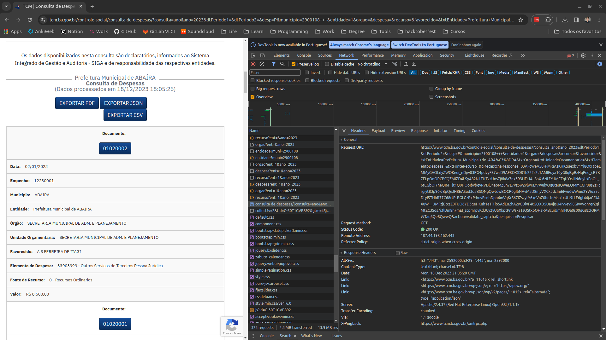

# TCM-BA

## Sobre o site

O site do [TCM da Bahia](https://www.tcm.ba.gov.br/controle-social/consulta-de-despesas/)possui um formulário de consulta de despesas.

O formulário possui campos com valores preenchidos inicialmente e outros que são atualizados após a seleção de um valor diferente. Por exemplo, o campo "entidade" é preenchido após a seleção de um município.

Ao final do preenchimento, é possível clicar em "Pesquisar". O site retorna uma página contendo uma tabela com os documentos encontrados.
Nessa página, existem as opções de exportar em Json, CSV e PDF. É possível visualizar os dados básicos na tabela e também clicar no link de um documento para ver os detalhes.

A página de um documento é bem detalhada e contém seções de Dados Básicos, Classificação Institucional, Classificação Funcional Programática, Classificação da Despesa e Dados da Licitação e Contratação.

## Exploração e Scraping

### Passo 1
A ideia inicial foi criar um projeto com Scrapy.
Em primeiro lugar, observar o dev tools e reproduzir as requisições feitas pelo site a fim de obter
os dados. E desenvovli o spider simples [passo1.py](passo1.py).
O spider pode ser executado com o comando:

```bash
scrapy runspider bahia/passo1.py
```

Porém, notei que o site utiliza o reCaptcha no formulário inicial e também no formulário de detalhes das despesas.
A imagem a seguir exibe a requisição enviada ao clicar no botão "Pesquisar".
É possível observar um conjunto de parâmetros resultantes do preenchimento, mas, além desses, o parâmetro `g-recaptcha-response` é adicionado dinamicamente. Diferentemente do reCaptcha que solicita um imput do usuário, esse é invisível e usa dados de navagação para distinguir se é um robô que está realizando a solicitação.



Isso inviabilizou a abordagem de simular as requisições.

### Passo 2

Desenvolvi também o script [passo2.py](passo2.py) usando o selenium para tentar simular uma navegação mais próxima da que um ser humano faria e ver como seria o resultado. O script pode ser executado com o comando:

```
python passo2.py
```
ou iterativamente no Ipython ou Jupyter notebook.
Porém, nessa abordagem, muitas requisições falharam e os objetos de despesas vieram vazios.

### Passo 3

Como alternativa, busquei por pistas de requisições a outras APIs feitas pelo site. Notei que, enquanto o site carrega, são feitas algumas requisições para a API https://webservice.tcm.ba.gov.br. Essa API possui alguns endpoints interessantes:
* `/despesas/orgao`: retorna os órgãos de um município e entidade. Ex: 
{
  "de_Orgao": "CAMARA MUNICIPAL",
  "cd_Orgao": "1"
}
* `/despesas/recurso`: retorna as fontes de recursos. Ex:
{
    "de_FonteRecurso": "Recursos não Vinculados de Impostos",
    "cd_FonteRecurso": "1500"
} 
* `/despesas/entidade`: retorna a lista de entidades de um minícipio. Ex:
{
    "nm_Unidade": "Prefeitura Municipal de ABAÍRA",
    "cd_Unidade": "1"
}
* `/despesas/despesa`: retorna a lista de despesas de uma entidade e ano. Ex:
{
    "de_Elemento": "Obrigações Patronais",
    "cd_Elemento": "31301300"
}

Também observei que o endpoint para exportar os dados como PDF não está protegido com reCaptcha.
Isso possibilitou a extração dos dados básicos disponíveis nesse relatório.
E o resultado foi o script [passo3.py](passo3.py).
Porém, esse script ainda não retorna todos os dados necessários.


## Recomendações

1. Procurar por um endpoint na API de webservices que forneça os detalhes das despesas. É provável que ele exista, mas não é certo.
2. Entrar em contato com o responsável técnico no TCM e verificar se os endpoints podem ser disponibilizados.
3. Procurar por uma outra possível fonte dessas informações.